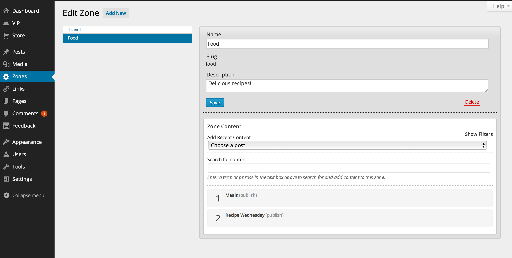
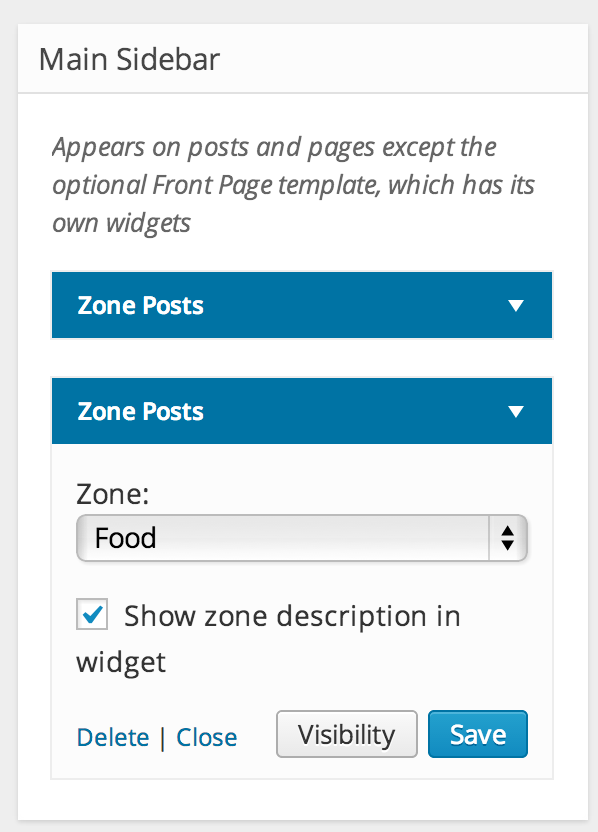
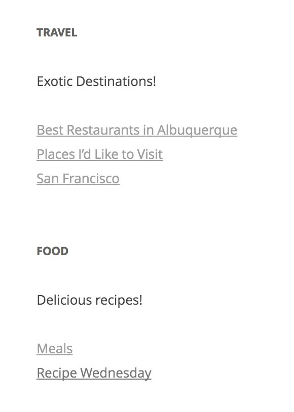

# Zone Manager (Zoninator) 

Content curation made easy! Create "zones" then add and order your content!
Assign and order stories within zones that you create, edit, and delete. Then use the handy API functions to retrieve and display your content in your theme. Or for those who are a bit code-averse, try the handy widget.

### What does this plugin do?

This plugin is designed to help you curate your content. It lets you assign and order stories within zones that you create, edit, and delete, and display those groupings of related stories on your site.

### How do I set it up?

After activating the plugin, you'll see a new "Zones" tab in your Dashboard's sidebar menu:



Create your zones, and easily search for and add existing posts.

Once you've set up your zones, use the handy API functions to retrieve and display your content in your theme. Or, for those who are a bit code-averse, go to Appearance-Widgets and add Zone Posts widgets to display your zone posts in your sidebar or footer:



The widget will pull the posts from the chosen zone:



More documentation for the plugin can be found on [the WordPress.org plugin page](https://wordpress.org/plugins/zoninator/).

### Usage examples

You can work with with a zone's posts either as an array or a WP_Query object.

**WP_Query**

```
$zone_query = z_get_zone_query( 'homepage' );
if ( $zone_query->have_posts() ) :
    while ( $zone_query->have_posts() ) : $zone_query->the_post();
        echo '<li>' . get_the_title() . '</li>';
    endwhile;
endif;
wp_reset_query();
```

**Posts Array**

```
$zone_posts = z_get_posts_in_zone( 'homepage' );
foreach ( $zone_posts as $zone_post ) :
    echo '<li>' . get_the_title( $zone_post->ID ) . '</li>';
endforeach;
```

#### FUNCTION REFERENCE

Get an array of all zones:

```
z_get_zones()
```

Get a single zone. Accepts either ID or slug.

```
z_get_zone( $zone )
```

Get an array of ordered posts in a given zone. Accepts either ID or slug.

```
z_get_posts_in_zone( $zone )
```

Get a WP_Query object for a given zone. Accepts either ID or slug.

```
z_get_zone_query( $zone );
```

More functions listed in functions.php