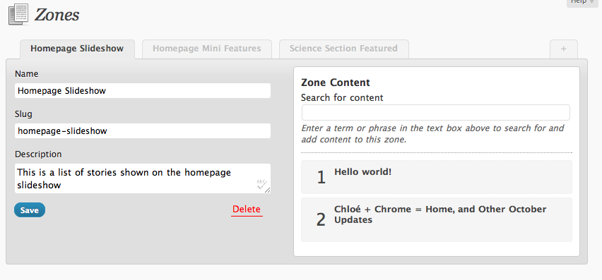
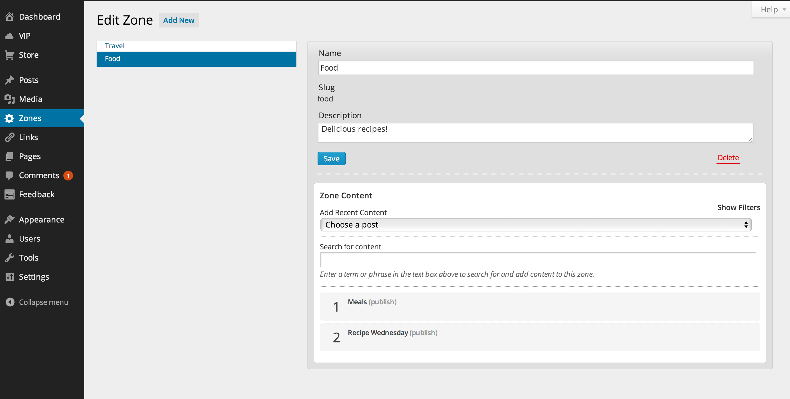
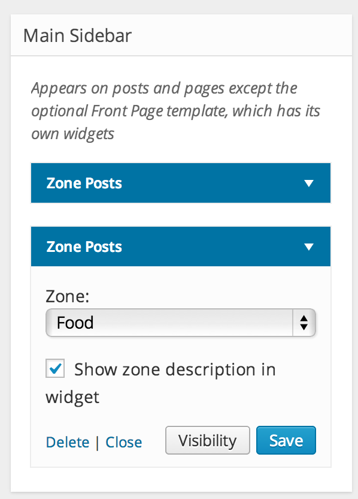
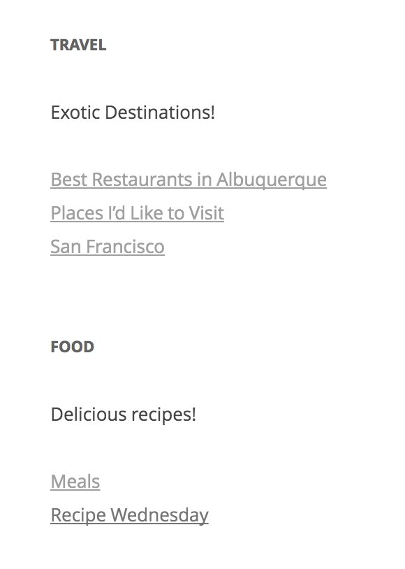

# Zone Manager (Zoninator)

Stable tag: 0.10.1  
Requires at least: 5.9  
Tested up to: 6.6  
Requires PHP: 7.4  
License: GPLv2 or later  
License URI: https://www.gnu.org/licenses/gpl-2.0.html  
Tags: zones, post order, post list, posts, order, zonination, content curation, curation, content management  
Contributors: batmoo, automattic, wpcomvip, pkevan, matthumphreys, potatomaster, jblz, nickdaugherty, betzster, garyj  

Content curation made easy! Create "zones" then add and order your content!

## Description

This plugin is designed to help you curate your content. It lets you assign and order stories within zones that you create, edit, and delete, and display those groupings of related stories on your site.

This plugin was originally built by [Mohammad Jangda](http://digitalize.ca) in conjunction with [William Davis](http://wpdavis.com/) and the [Bangor Daily News](http://www.bangordailynews.com/).

### Features

* Add, edit, and delete zones.
* Add and remove posts (or any custom post type) to or from zones.
* Order posts in any given zone.
* Limit capabilities on who can add, edit, and delete zones vs add content to zones.
* Locking mechanism, so only one user can edit a zone at a time (to avoid conflicts).
* Idle control, so people can't keep the zone locked.

## Installation

1. Unzip contents and upload to the `/wp-content/plugins/` directory
2. Activate the plugin through the 'Plugins' menu in WordPress
3. Go to Dashboard > Zones to create and manage your zones, and easily search for and add existing posts.
4. Use the plugin's handy API functions to add zones to your theme that retrieve and display your content. Or, for those who are a bit code-averse, go to Appearance-Widgets and add Zone Posts widgets to display your zone posts in your sidebar or footer. The widget will pull the posts from the chosen zone.

### Usage examples

You can work with a zone's posts either as an array or a WP_Query object.

**WP_Query**

~~~php
$zone_query = z_get_zone_query( 'homepage' );
if ( $zone_query->have_posts() ) :
	while ( $zone_query->have_posts() ) : $zone_query->the_post();
		echo '<li>' . get_the_title() . '</li>';
	endwhile;
endif;
wp_reset_query();
~~~

**Posts Array**

~~~php
$zone_posts = z_get_posts_in_zone( 'homepage' );
foreach ( $zone_posts as $zone_post ) :
	echo '<li>' . get_the_title( $zone_post->ID ) . '</li>';
endforeach;
~~~

## Function Reference

Get an array of all zones:

~~~php
z_get_zones()
~~~

Get a single zone, accepts either ID or slug:

~~~php
z_get_zone( $zone )
~~~

Get an array of ordered posts in a given zone, accepts either ID or slug:

~~~php
z_get_posts_in_zone( $zone )
~~~

Get a WP_Query object for a given zone, accepts either ID or slug:

~~~php
z_get_zone_query( $zone );
~~~

More functions listed in `functions.php`.

## Frequently Asked Questions

### How do I disable the locking feature?

You can use a filter:

~~~php
add_filter( 'zoninator_zone_max_lock_period', 'z_disable_zoninator_locks' );
~~~

### How do I change the locking feature settings?

Filter the following and change according to your needs:

* Number of seconds a lock is valid for, default `30`: `zoninator_zone_lock_period`
* Max idle time in seconds: `zoninator_zone_max_lock_period`

## Changelog

Please visit the [changelog](https://github.com/automattic/zoninator/blob/trunk/CHANGELOG.md).

## Screenshots

1. Create and manage your zones and content through a fairly intuitive and familiar interface.
   
2. Zone editing  
   
3. Use the Zone Posts widget in the widgets area.  
   
4. Output of the zone posts widgets.  
   
