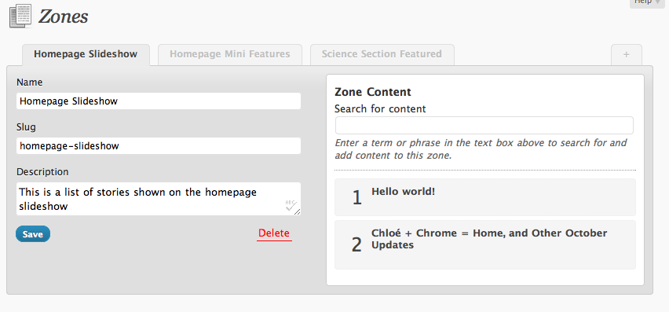
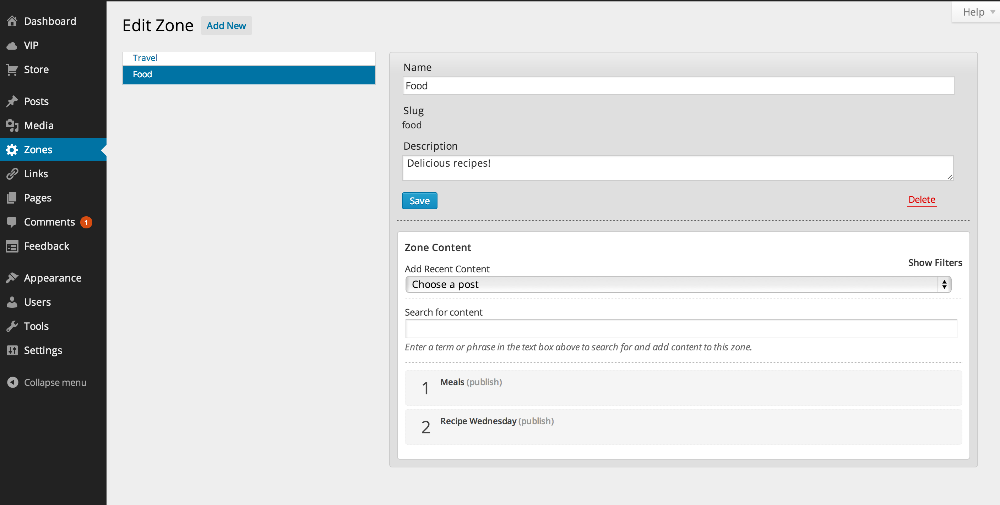
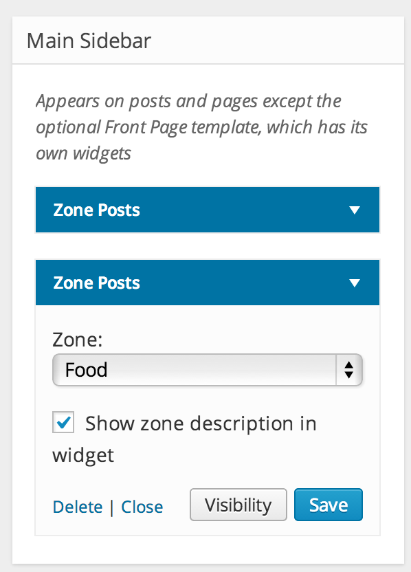
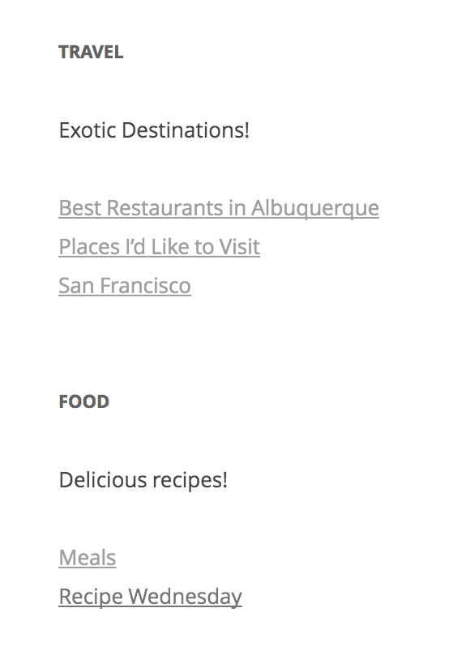

# Zone Manager (Zoninator)

Stable tag: 0.11.0  
Requires at least: 6.4  
Tested up to: 6.9  
Requires PHP: 7.4  
License: GPLv2 or later  
License URI: https://www.gnu.org/licenses/gpl-2.0.html  
Tags: zones, post order, post list, posts, order, zonination, content curation, curation, content management  
Contributors: batmoo, automattic, wpcomvip, pkevan, matthumphreys, potatomaster, jblz, nickdaugherty, betzster, garyj  

Content curation made easy! Create "zones" then add and order your content!

## Description

This plugin is designed to help you curate your content. It lets you assign and order stories within zones that you create, edit, and delete, and display those groupings of related stories on your site.

This plugin was originally built by [Mohammad Jangda](http://digitalize.ca) in conjunction with [William Davis](http://wpdavis.com/) and the [Bangor Daily News](http://www.bangordailynews.com/).

### Features

* Add, edit, and delete zones.
* Add and remove posts (or any custom post type) to or from zones.
* Order posts in any given zone.
* Limit capabilities on who can add, edit, and delete zones vs add content to zones.
* Locking mechanism, so only one user can edit a zone at a time (to avoid conflicts).
* Idle control, so people can't keep the zone locked.

## Installation

1. Unzip contents and upload to the `/wp-content/plugins/` directory
2. Activate the plugin through the 'Plugins' menu in WordPress
3. Go to Dashboard > Zones to create and manage your zones, and easily search for and add existing posts.
4. Use the plugin's handy API functions to add zones to your theme that retrieve and display your content. Or, for those who are a bit code-averse, go to Appearance-Widgets and add Zone Posts widgets to display your zone posts in your sidebar or footer. The widget will pull the posts from the chosen zone.

### Usage examples

You can work with a zone's posts either as a `WP_Query` object or as a plain array.

**WP_Query**

~~~php
$zone_query = z_get_zone_query( 'homepage' );
if ( $zone_query->have_posts() ) :
	while ( $zone_query->have_posts() ) : $zone_query->the_post();
		echo '<li>' . esc_html( get_the_title() ) . '</li>';
	endwhile;
	wp_reset_postdata();
endif;
~~~

**Posts Array**

~~~php
$zone_posts = z_get_posts_in_zone( 'homepage' );
foreach ( $zone_posts as $zone_post ) :
	echo '<li>' . esc_html( get_the_title( $zone_post->ID ) ) . '</li>';
endforeach;
~~~

For the full template-tag reference, see the [theme developer guide](https://github.com/Automattic/zoninator/blob/main/docs/theme-developers.md).

## Documentation

Audience-targeted documentation lives in the GitHub repository:

* [Theme developer guide](https://github.com/Automattic/zoninator/blob/main/docs/theme-developers.md) — using zones in your theme.
* [Hooks reference](https://github.com/Automattic/zoninator/blob/main/docs/hooks.md) — every filter and action the plugin exposes.
* [REST API](https://github.com/Automattic/zoninator/blob/main/docs/rest-api.md) — endpoints under the `zoninator/v1` namespace, for headless integrations.
* [Contributing](https://github.com/Automattic/zoninator/blob/main/CONTRIBUTING.md) — local setup, tests, and PR conventions.
* [Security](https://github.com/Automattic/zoninator/blob/main/SECURITY.md) — responsible disclosure.

## Frequently Asked Questions

### How do I disable the locking feature?

You can use a filter:

~~~php
add_filter( 'zoninator_zone_max_lock_period', 'z_disable_zoninator_locks' );
~~~

### How do I change the locking feature settings?

Filter the following and change according to your needs:

* Number of seconds a lock is valid for, default `30`: `zoninator_zone_lock_period`
* Max idle time in seconds: `zoninator_zone_max_lock_period`

### Can anonymous users still read zones over the REST API?

Not by default since version 0.11.0. The `GET /wp-json/zoninator/v1/zones` endpoint now requires an authenticated user. If your integration relied on anonymous access, you can restore the previous behaviour with the `zoninator_rest_get_zones_permissions_check` filter:

~~~php
add_filter( 'zoninator_rest_get_zones_permissions_check', '__return_true' );
~~~

See the [REST API documentation](https://github.com/Automattic/zoninator/blob/main/docs/rest-api.md) for the full endpoint reference.

### Can I use Zoninator with custom post types?

Yes. Call `Zoninator()->register_zone_post_type( 'your_post_type' )` after `init` to add zone support to a custom post type.

## Upgrade Notice

### 0.11.0

The `GET /wp-json/zoninator/v1/zones` REST endpoint now requires an authenticated user. If your site depends on anonymous access, opt back in with the `zoninator_rest_get_zones_permissions_check` filter. Three security fixes are included — review the changelog before upgrading.

## Changelog

Please visit the [changelog](https://github.com/Automattic/zoninator/blob/main/CHANGELOG.md).

## Screenshots

1. Create and manage your zones and content through a fairly intuitive and familiar interface.
   
2. Zone editing  
   
3. Use the Zone Posts widget in the widgets area.  
   
4. Output of the zone posts widgets.  
   
